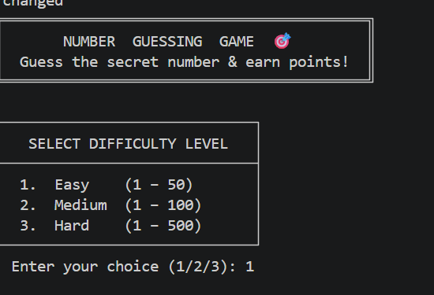
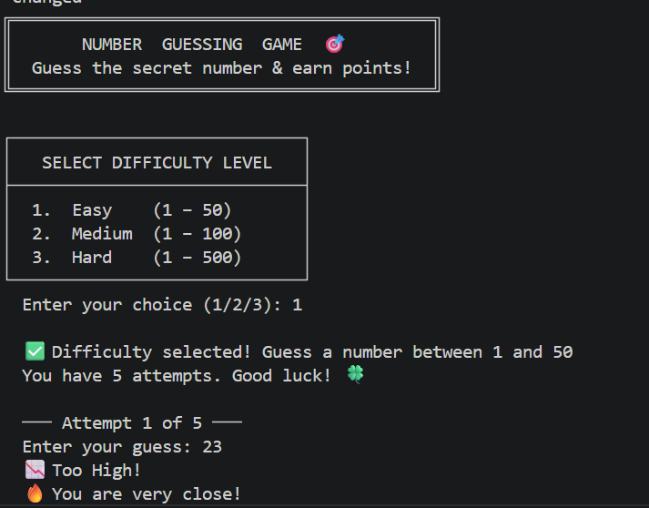
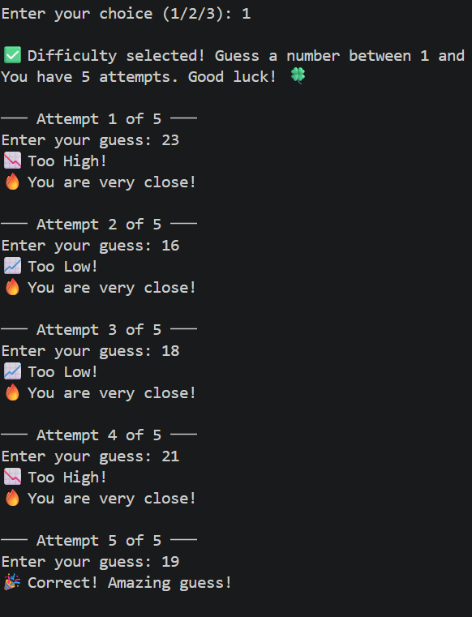
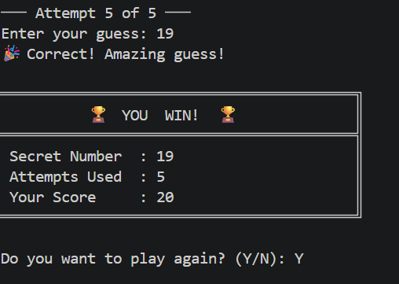
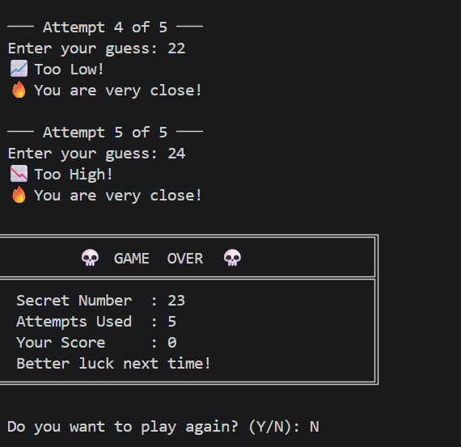
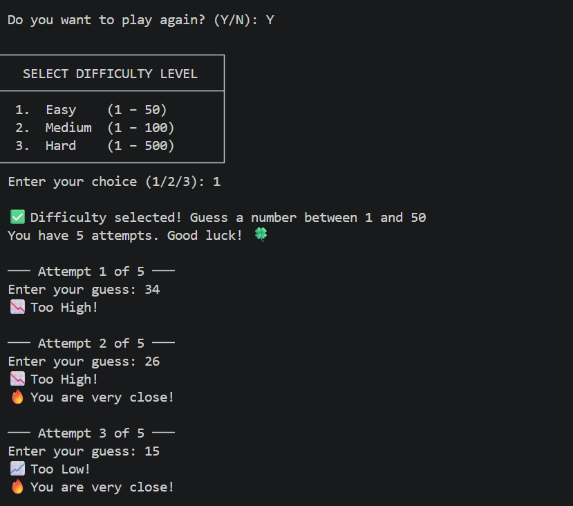

# 🎮 Java Number Guessing Game
## 📌 Project Overview
This is a Java console-based Number Guessing Game where players try to guess a randomly generated secret number within a limited number of attempts. The game provides hints, scoring, multiple difficulty levels, and a play-again feature to make the gameplay more interactive and engaging.
## 🚀 Features
✅ Difficulty Levels (Easy, Medium, Hard)
✅ Random Number Generation
✅ Hint System (Too High / Too Low)
✅ Limited Attempts (5 Attempts)
✅ Score System
✅ Winning and Game Over Screens
✅ Play Again Feature
✅ User-Friendly Console Interface
## 🛠 Technologies Used
* Java
* VS Code
* GitHub
## ▶️ How to Run
1. Open the project in VS Code.
2. Compile the Java file.
3. Run the program.
4. Select a difficulty level.
5. Guess the secret number.
6. View your score and play again if desired.
## 🖥️ Screenshots
### 🏠 Game Home Screen

### 🎯 Difficulty Selection

### 💡 Gameplay with Hints

### 🏆 Winning Screen

### 💀 Game Over Screen

### 🔁 Play Again Feature

### 👋 Exit Message

## 📚 Learning Outcomes
Through this project, I gained hands-on experience in:
* Java Programming Fundamentals
* Conditional Statements and Loops
* User Input Handling using Scanner
* Random Number Generation
* Problem Solving and Logical Thinking
* GitHub Repository Management
## 👩‍💻 Author
Yamunasri
