# 📋 Online Examination System — Java
<p align="center">
  
  
  
  
</p>
---
## 📌 About the Project
A **console-based Online Examination System** built using Core Java as part of the **Oasis Infobyte Java Development Internship (Task 4)**.
The system allows students to log in, update their profile, attempt a timed MCQ exam, and logout securely. The exam auto-submits when the timer runs out.
---
## ✨ Features
| Feature | Description |
|---|---|
| 🔐 Login System | Username and password authentication with 3-attempt lockout |
| 👤 Update Profile | Update full name, email address, and password |
| 📝 MCQ Exam | 10 Java-based multiple choice questions |
| ⏱️ Timer | 120-second countdown with auto-submit |
| 🏆 Score & Grade | Score calculated with percentage and grade |
| 🔓 Logout | Secure session close and logout |
| ✅ Input Validation | Handles all invalid inputs gracefully |
---
## 🖥️ Screenshots
### 🏠 Home Page
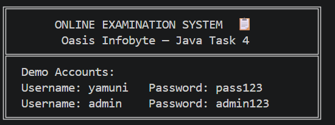
### 🔐 Login Page
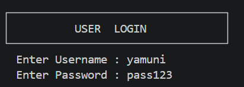
### ✅ Login Success
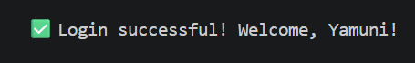
### 📊 Dashboard Menu
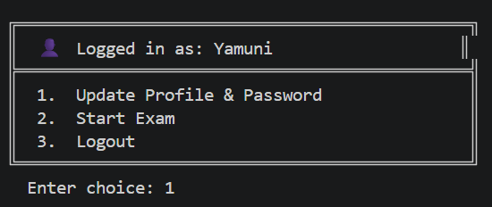
### 👤 Profile Update
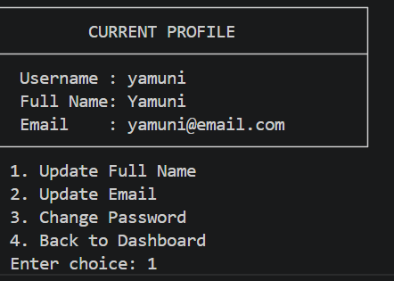
### 📧 Email Update
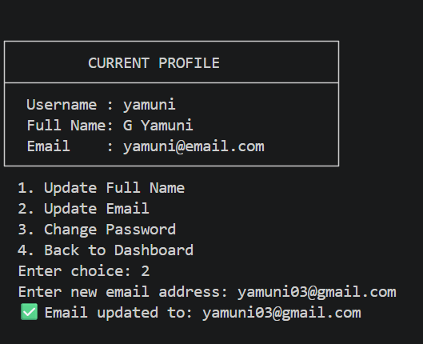
### 🔑 Password Change
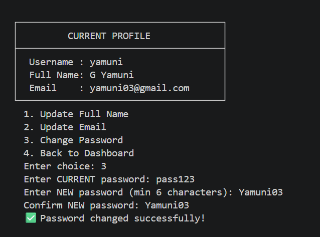
### 🚀 Start Exam
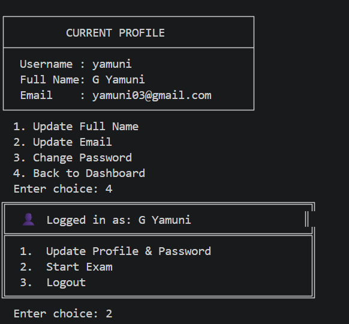
### 📋 Exam Instructions & Q1
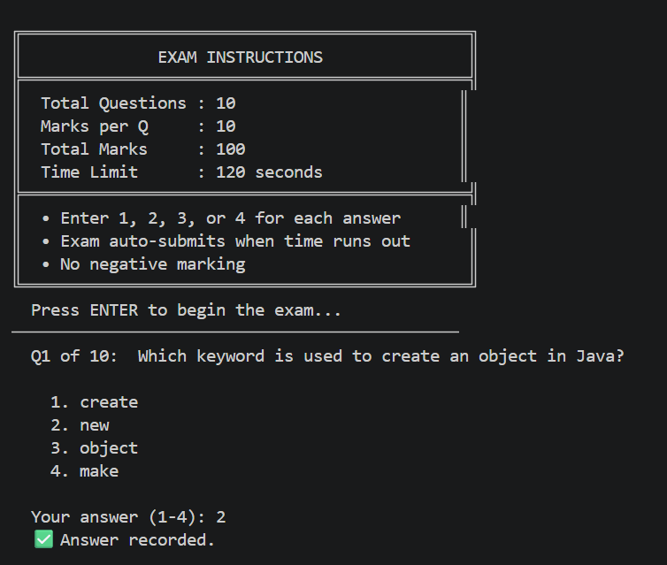
### 📝 Questions 2–3
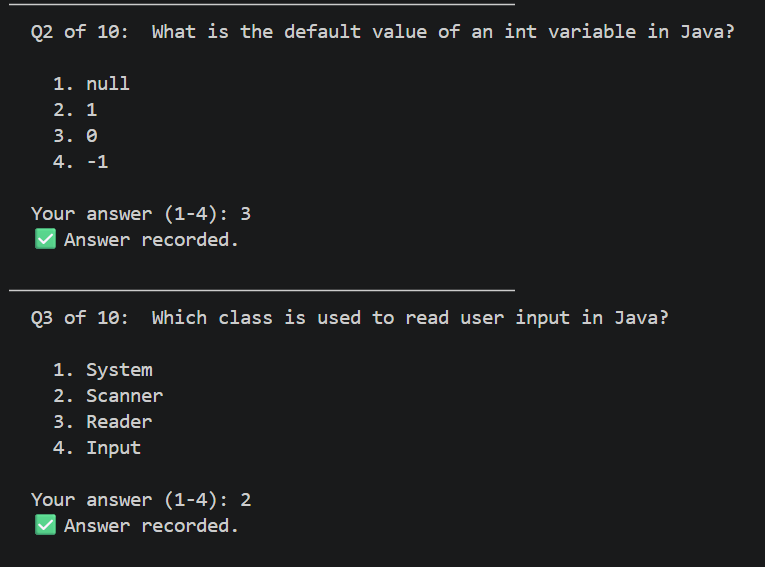
### 📝 Questions 4–6
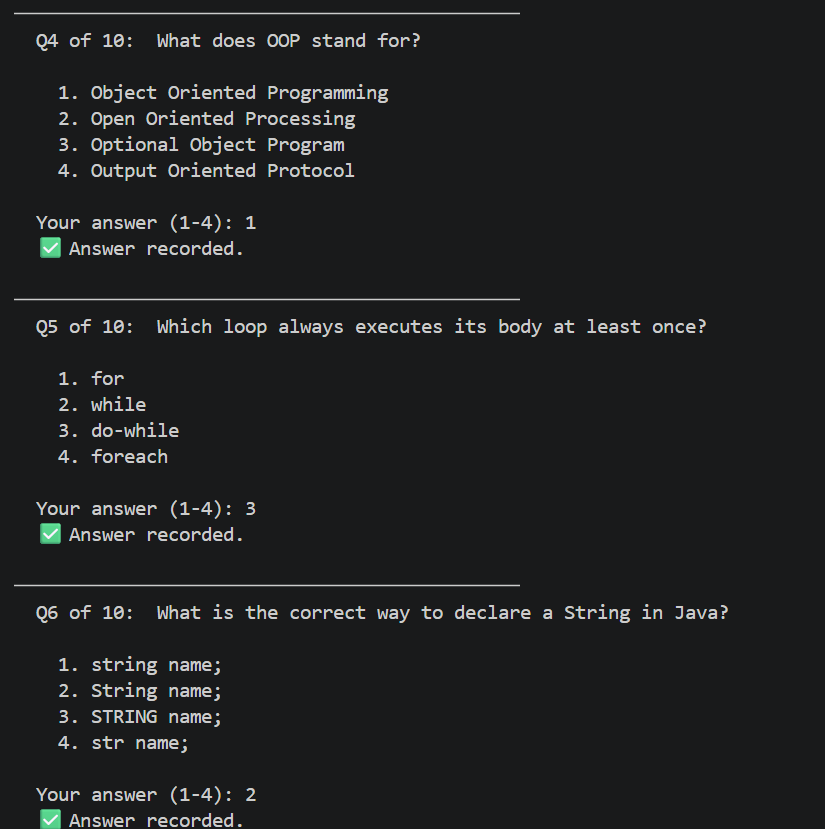
### 📝 Questions 7–9
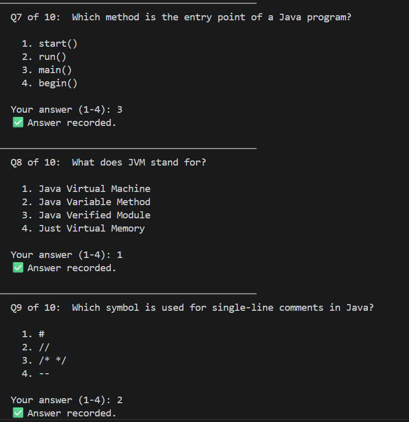
### 📝 Question 10
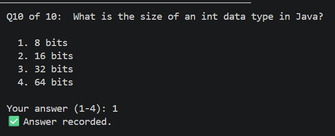
### 🏆 Exam Result
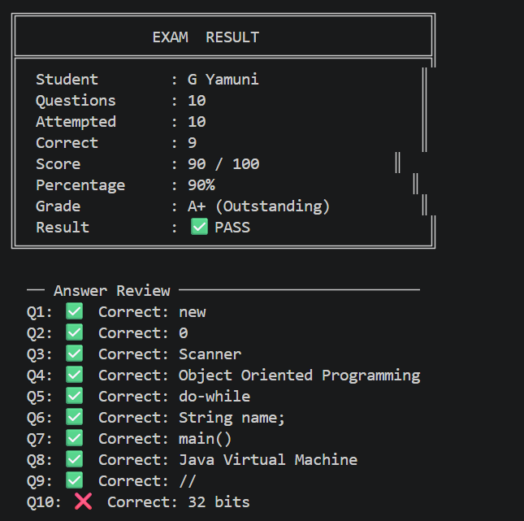
### 🔓 Logout
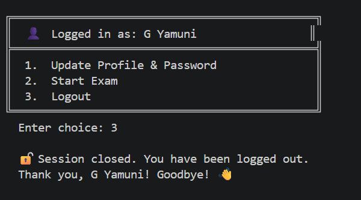
---
## ⚙️ How to Run
### Prerequisites
- Java JDK 8 or higher installed
- VS Code or any Java IDE
### Steps
```bash
# Step 1: Clone the repository
git clone https://github.com/YAMUNASRI04/OIBSIP.git
# Step 2: Navigate to the project folder
cd OIBSIP/OnlineExamproject
# Step 3: Compile all Java files
javac *.java
# Step 4: Run the program
java Main
---
## 🧑‍💻 Java Concepts Used
- `HashMap` — in-memory user database
- `Scanner` class — user input handling
- `Thread` — background countdown timer
- `AtomicBoolean` — thread-safe timer flag
- `try-catch` — input validation
- `switch` statement — menu navigation
- `ArrayList` / Arrays — question bank
- OOP — separate classes for each module
- Methods — modular, clean code structur
---
## 👩‍💻 Author
Yamunasri
---
